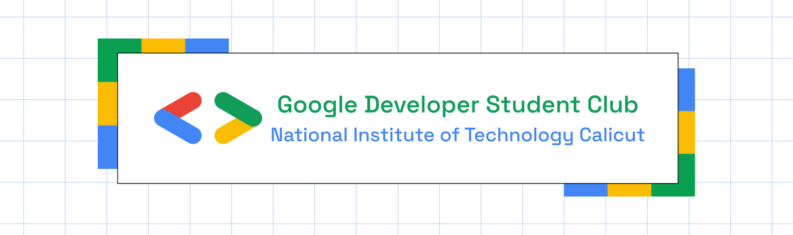

	<h2 align="center">  NITC-Connect </h2>
	<h4 align="center"> NITC-Connect is a mobile-friendly web app that helps college students stay in the loop. It lets you follow interest groups you care about and get notified when there's new content, without the noise of traditional emails. Think of it as your personal campus bulletin board that only shows what matters to you, delivered right to your phone or laptop whenever there's something new. </h4>

---

## ✨ Features
- [ ]  User Login
- [ ]  Create Interest Groups
- [ ]  Join Interest groups via Access Codes
- [ ]  Create Post in Interest Groups
- [ ]  View Notifications
- [ ]  Enable/ Disable Notifications

## 💻 Tech Stack 

- React.JS

## 🛠 Dependencies
- Vite

## CONTRIBUTORS

<table>
	<tr align="center">
		<td>
		A Yashwanth
		

			
		

        

            
            
        

		</td>
		<td>
		Poosa Yashwanth
		

			
		

        

            
            
        

		</td>
		<td>
		K Sai Dinesh
		

			
		

        

            
            
        

		</td>
		<td>
		Maria Thomas
		

			
		

        

            
            
        

		</td>
		<td>
		G Shiva Kumar
		

			
		

        

            
            
        

		</td>
	</tr>
    
</table>
